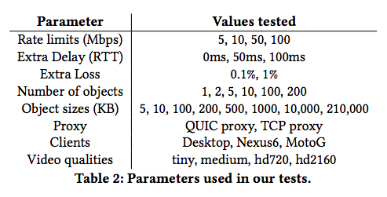
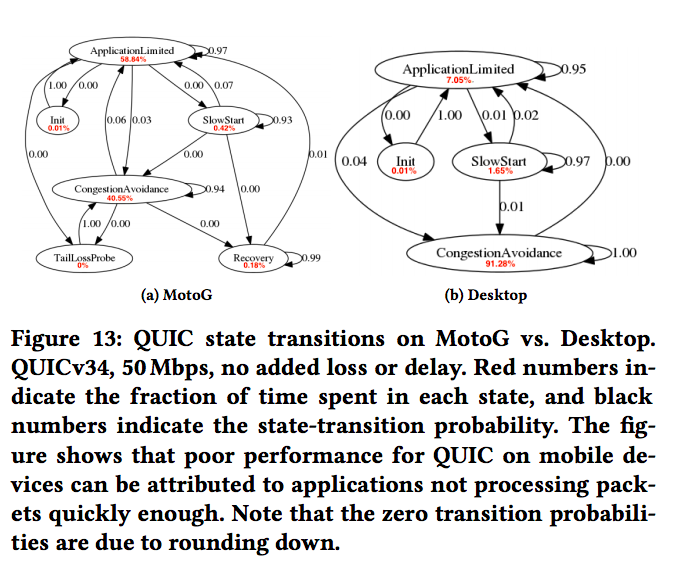

# QUIC-HTTP/3 Benchamark

## Purpose

Accurately benchmark multiple QUIC implementations to find areas of improvement. Benchmarks are focused on performance rather than accuracy of implementations compared to IETF draft.

## Related Works

Litespeed have open sourced their own QUIC [benchmarks](https://github.com/litespeedtech/lsquic). 

Another open sourced QUIC [benchmark](https://github.com/Shenggan/quic_vs_tcp)

Great paper about robust QUIC benchmarking methodology: [Taking a Long Look at QUIC (Sigcomm '17)](https://conferences.sigcomm.org/imc/2017/papers/imc17-final39.pdf)

Overall, there is no comprehensive, open-sourced QUIC/HTTP3 benchmark that compares multiple QUIC server implementations.

## Benchmark Scenarios



Source: [Taking a Long Look at QUIC (Sigcomm '17)](https://conferences.sigcomm.org/imc/2017/papers/imc17-final39.pdf)

For this benchmark, we will be ignoring **proxy**, **clients**, and **video quality** parameters. Network behavior will be emulated on local loopback interface using ```tc``` and ```netem```. 

### Parameters
- Network Emulation
  - Rate limits
  - Extra Delay
  - Extra Loss
- Web Page
  - Number of objects (images)
  - Object sizes (image sizes)

Other types of scenarios? Namely video streaming? Would be difficult to implement optimized/consistent video streaming application across multiple implementations of QUIC

## Measuring Results

- Repeat each scenario 10 times for each QUIC server implementation
- Chromium QUIC client will be used for all benchmarks. Will turn off caching
- Benchmarks should be automated
- Web pages will be populated by images of various sizes depending on benchmark

> For Chrome, we evaluate QUIC performance using web pages consisting of static HTML that references JPG images (various number and sizes of images) without any other object dependencies or scripts. While previous work demonstrates that many factors impact load times and user-perceived performance for typical, popular web pages [4, 33, 39], the focus of this work is only on transport protocol performance. Our choice of simple pages ensures that page load time measurements reflect only the efficiency of the transport protocol and not browser-induced factors such as script loading and execution time. Furthermore, our simple web pages are essential for isolating the impact of parameters such as size and number of
objects on QUIC multiplexing. We leave investigating the effect of dynamic pages on performance for future work.

Source: [Taking a Long Look at QUIC (Sigcomm '17)](https://conferences.sigcomm.org/imc/2017/papers/imc17-final39.pdf)

- Performance will be measured by Page-Load Times (PLT)

## Instrumentation (Optional)

State Machine Analysis by instrumenting QUIC implementations with logs. Most likely will be quite time-consuming but could prove very useful for anaylsis.



Source: [Taking a Long Look at QUIC (Sigcomm '17)](https://conferences.sigcomm.org/imc/2017/papers/imc17-final39.pdf)

A diagram like the one above would be nice but might be out of scope for an individual project.

## Implementations

### Client
- Google: [chromium](https://www.chromium.org/quic/playing-with-quic)


### Server
- Facebook: [mvfst](https://github.com/facebookincubator/mvfst)/[proxygen](https://github.com/facebook/proxygen)
- Microsoft: [msquic](https://github.com/microsoft/msquic)
- Google: [chromium](https://www.chromium.org/quic/playing-with-quic)
- Mozilla: [neqo](https://github.com/mozilla/neqo)
- Litespeed: [lsquic](https://github.com/litespeedtech/lsquic)

There are many more QUIC implementations listed [here](https://github.com/quicwg/base-drafts/wiki/Implementations) 

## Discussion

- Benchmark multiple QUIC clients as well?
  - For instance, I'd imagine mvfst's client is optimized to work with mvfst's server
- Benchmark congestion window handling? 
- How to ensure statistical significance between results? 
- Will ample configuration be required for each QUIC implementation?


## Timeline

1. Get QUIC/HTTP3 servers up and running for at least 3 different implementations
2. Create example web pages for each experiment
3. Measure PLTs for each QUIC server without any network manipulation
4. TBD