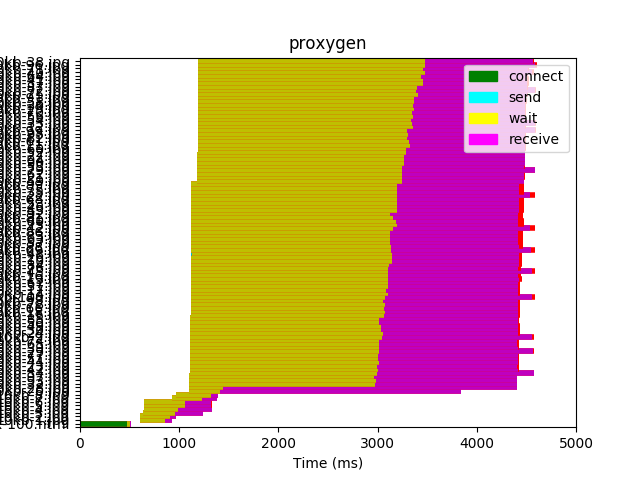
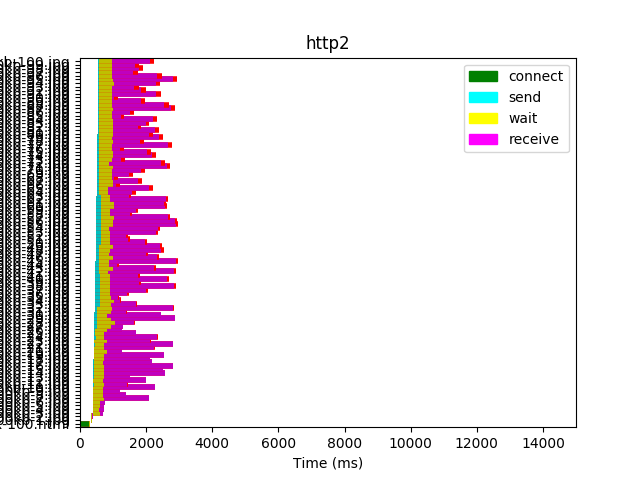
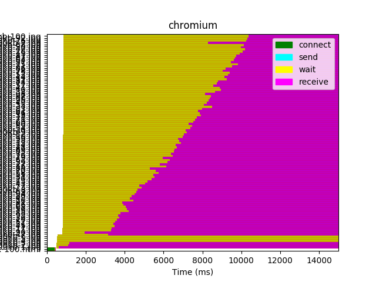
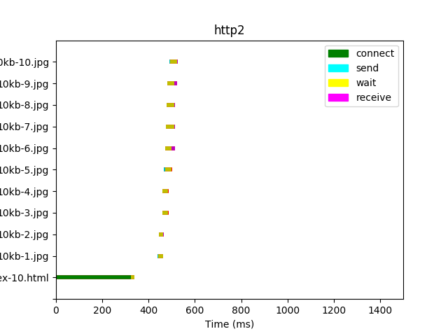
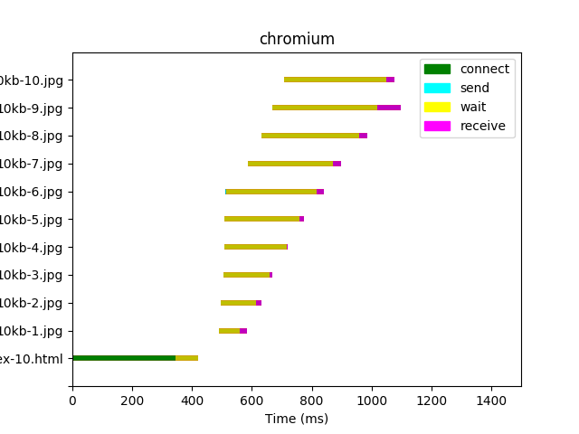
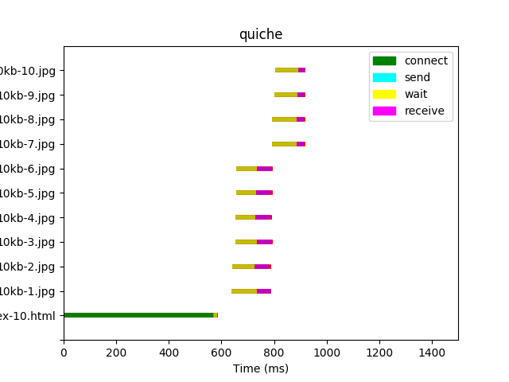

# Results

## Preliminary Results [6/2/20 IETF QUIC Draft 27]

Legend:
| Key                                            | Explanation                                           |
| ---------------------------------------------- | ----------------------------------------------------- |
| **connect**   | Time required to create TCP/QUIC connection           |
| **send**       | Time required to send HTTP request to the server      |
| **wait**     | Waiting for a response from the server                |
| **receive** | Time required to read entire response from the server |

Client: Google Chrome Canary (Version 85.0.4162.0)

Servers:
- Http2: [Apache httpd:2.4](https://hub.docker.com/_/httpd)
- Chromium: 
- Proxygen: [CommitID: 1ec10a (5/29/20)](https://github.com/facebook/proxygen/commit/1ec10a60ab7634d6f804ccada7b3e123a93e23d6)
- Quiche: [CommitID: 51fb56 (5/31/20)](https://github.com/cloudflare/quiche/commit/51fb5609190db2d087c8c0c62c6f24ab054421cd)

### Size: 10kb, Num objects: 100

### Size: 100kb, Num objects: 100

### Size: 10kb, Num objects: 10

### Size: 100kb, Num objects: 10

