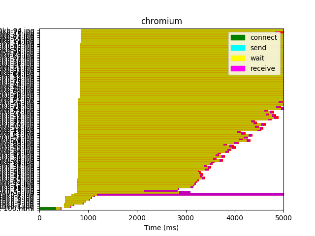
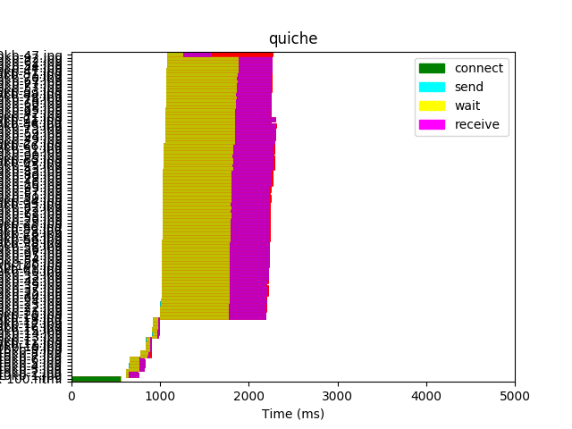
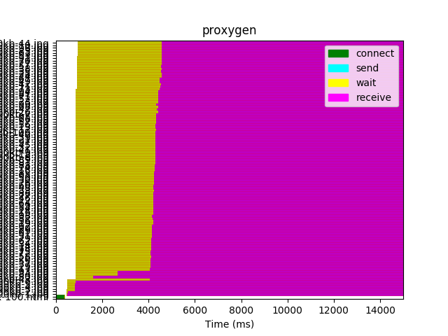
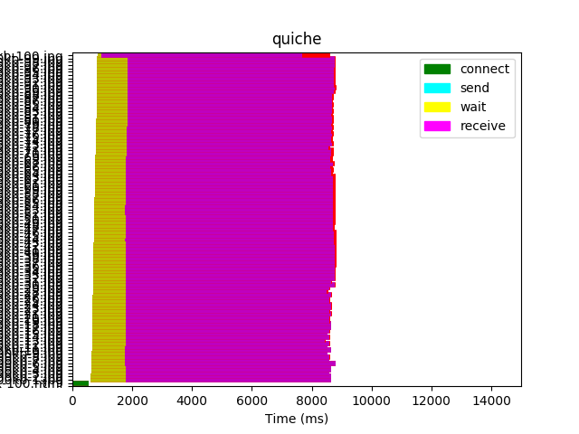
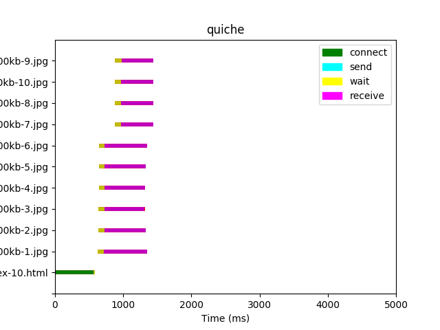

# Results

## Preliminary Results

Legend:
| Key                                            | Explanation                                           |
| ---------------------------------------------- | ----------------------------------------------------- |
| **connect**   | Time required to create TCP/QUIC connection           |
| **send**       | Time required to send HTTP request to the server      |
| **wait**     | Waiting for a response from the server                |
| **receive** | Time required to read entire response from the server |

### Size: 10kb, Num objects: 100

### Size: 100kb, Num objects: 100

### Size: 10kb, Num objects: 10

### Size: 100kb, Num objects: 10

